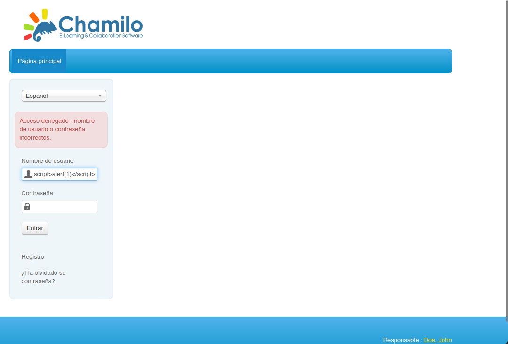

# CHAPTER 10 - Encoding & Filtering

## Encoding

1. The range of ASCII values for uppercase letters is 65 to 90.

2. In ASCII, the decimal value 32 represents the space character.

3. A major advantage of Unicode over older character encodings like ASCII is its support for a wide range of languages and symbols.

4. HTML encoding is commonly used to prevent security vulnerabilities like cross-site scripting (XSS) in HTML form submissions.

5. The HTML entity used to encode a non-breaking space is `&nbsp`.

6. In URL encoding, the special character represented as `%20` is a space.

7. The character encoded as `%2F` in URL encoding is a forward slash.

8. In Base64 encoding, the character used as a padding character to ensure the length is a multiple of 4 is the equals sign (`=`).

9. In Base64 encoding, 18 bits of binary data are represented using 3 characters.

## Filtering

1. Input validation typically involves ensuring that input data adheres to predefined rules and constraints.

2. An example of input sanitization is removing or encoding potentially dangerous characters from user inputs.

3. One limitation of relying solely on client-side filtering for security is that it cannot prevent server-side vulnerabilities.

4. An advantage of client-side filtering is that it reduces the need for server resources or bandwidth.

5. An example of server-side filtering for preventing SQL injection attacks is using prepared statements in database queries.

### **LABORATORY 1**. Damn Vulnerable Web Application

User: admin
Password: password

This is the web page interface.


Select the **DVWA Security**, **low** and select the **XSS(Reflected)**.


**DVWA** let us to see the source code.


Now select the **medium**. Inspection the source code we see that we have a piece of code that exchange the `<script>` for a whitespace.


Then if we try the simple XSS injection nothing will happen.


Time to bypass this. Using capital letters.


Now let's select the **hard** level and suppose we can't see the source code.


Let's try with **Burp Suite**. Capture the request and send it to intruder.


Select the payload. I have used this `/usr/share/SecLists/Fuzzing/XSS/XSS-BruteLogic.txt`.


Now look the length and see which one works. This one seems to work.


It does.


### **LABORATORY 2**. Chamilo LMS

**Objective**: Your task is to find and exploit this vulnerability.

This is the web page interface.


Let's try a **XSS injection**. Not working.



Search information about the framework.


Take a look and try to simulate the exploit.


It works.


## Evasion


1. In the context of web application security, "filter evasion" is a method used to bypass input validation filters.

### **LABORATORY 1**. Squid: Browser Based Restriction

**Objective**: You have to figure out a way to access the web portal and retrieve the flag!

The target is this.

```bash
192.51.180.3
```
Doing a nmap scan.


If we try to access using curl the request will be denied.

```bash
curl -x 192.51.180.3:3128 127.0.0.1:80
```


The problem is that we only can access via Firefox and we are in a terminal with out access to firefox. The solution.

```bash
curl -H "User-agent: Firefox" -x 192.51.180.3:3128 127.0.0.1:80
```
