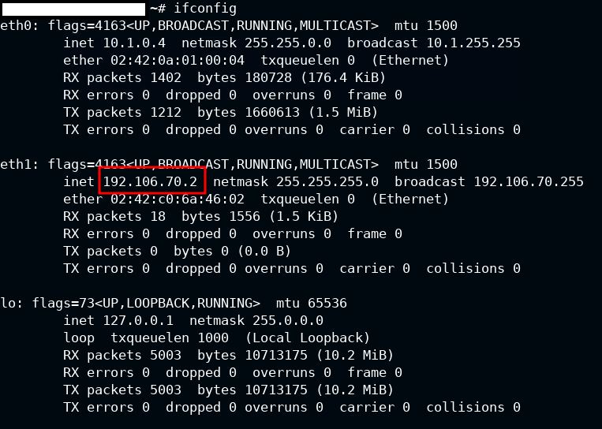
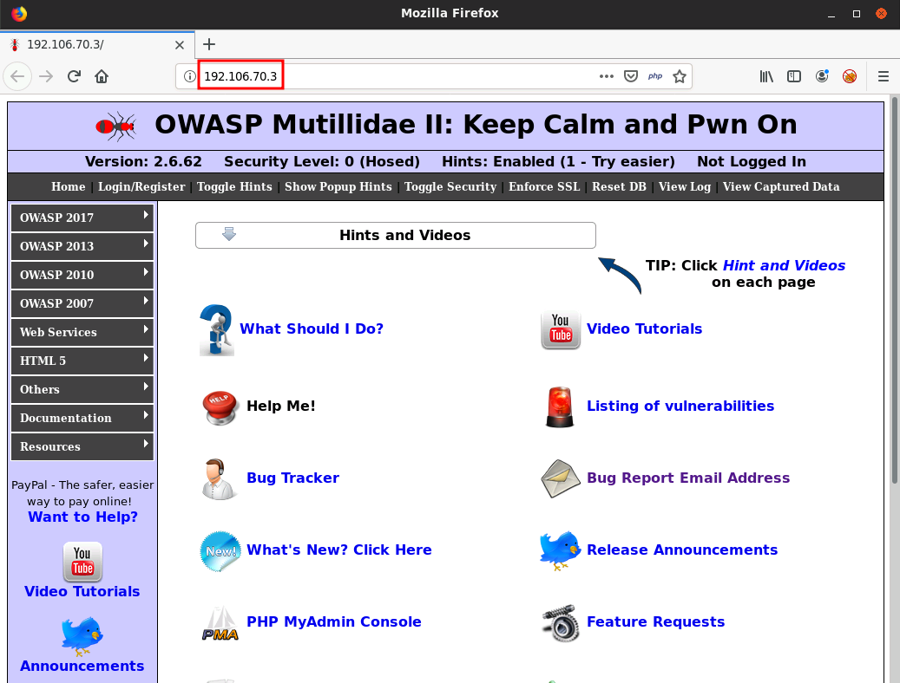
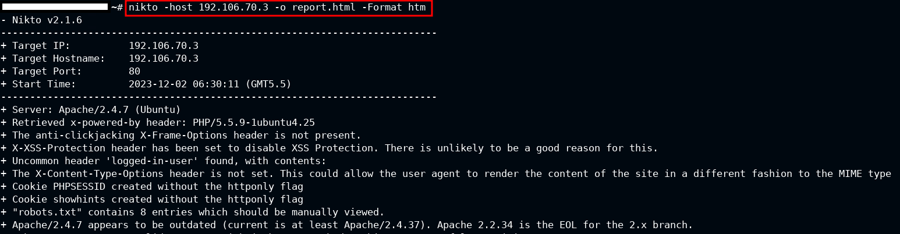
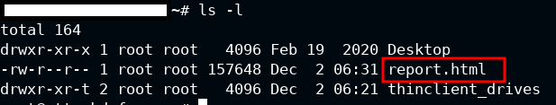
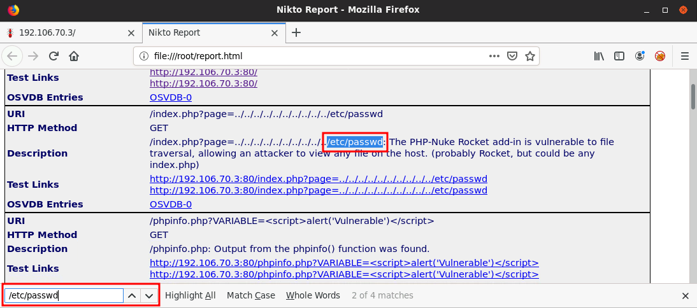
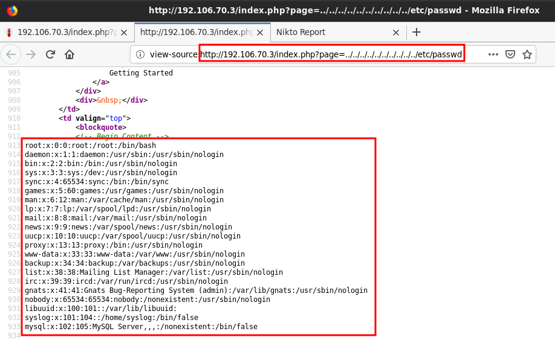

# CHAPTER 2 - Web Fingerprinting and Enumeration

## Web Enumeration & Information Gathering

**Key Aspects:**
- Website & domain ownership
- IP addresses, domains, and subdomains
- Hidden files & directories
- Hosting infrastructure (web server, CMS, database, etc.)
- Presence of defensive solutions like a web application firewall (WAF)

1. Port scanning is a **false** passive reconnaissance technique.

2. OWASP Web Security Testing Guide outlines **10** information gathering tests.

###  OWASP Testing Checklist

- **Various tests** including search engine discovery, web server fingerprinting, reviewing web server metafiles, enumerating applications, and more.

## Finding Ownership & IP Addresses

1. The Whois lookup utility can identify the nameservers of a domain (**True**).

2. Netcraft can be used to identify the presence of a web proxy or WAF (**True**).

3. DNS record to resolve a domain to a mail server is **MX**.

## Reviewing Webserver Metafiles for Information Leakage

1. The Disallow directive specifies prohibited resources for search engine crawlers (**True**).

## Search Engine Discovery

1. Google search query for subdomains of INE.com: **site:*.ine.com**.

#### Google Dorks

- Various search operators for targeted information retrieval.

## Web App Fingerprinting

1. BuiltWith browser add-on can enumerate JavaScript libraries (**True**).

2. Wafw00f command to enumerate all possible instances of a WAF: **wafw00f http://ine.com -a**.

#### Web App Technology Fingerprinting

- Tools include BuiltWith, Wappalyzer, and terminal tools like whatweb.

#### WAF Detection

- **Wafw00f** tool identifies WAFs with commands and provides valuable information.

## Source Code Analysis

1. HTTrack utilizes spidering to find and download files from a web server (**True**).

2. EyeWitness not only takes screenshots but also downloads the website source code (**True**).

## Website Crawling & Spidering

1. Spidering is a **false** passive information gathering technique.

## Web Servers

1. The http-enum.nse Nmap script **does not** utilize the robots.txt file to identify potentially interesting directories (**False**).

## DNS Enumeration

**DNS RECORDS:**
- A, AAAA, NS, MX, CNAME, TXT, HINFO, SOA, SRV, PTR

1. DNS record used to specify domain aliases is **CNAME**.

## Subdomains

1. Sublist3r can be used to perform brute-force subdomain enumeration (**True**).

## Web Server Vulnerability Scanning

1. Nikto can be used to identify potentially interesting files and directories on a web server (**True**).

#### **LABORATORY 1**. Scanning Web Application with Nikto

**Objective**: Scan the web application with Nikto and identify the possible vulnerabilities. 

First i have to identify which is the target. The target will be our ip but using a 3 instead a 2.



Now we know which our target is.



using this command we will get a file with all the content, the file will have the htm format.

```bash
nikto -host ip -o report.html -Format htm
```




Now we can see the report in our browser and filter by key words and try to identify vulnerabilites.



Let's check the vulnerability.



It worked!

## File & Directory Enumeration

1. Gobuster provides you with the ability to specify a custom timeout duration.

## Automated Recon Frameworks

1. OWASP Amass can resolve subdomains to their respective IP addresses.