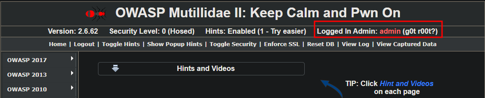
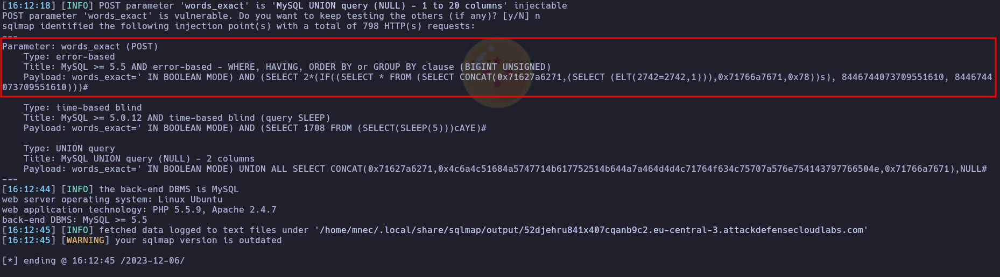
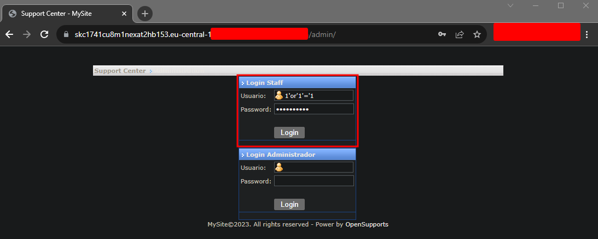
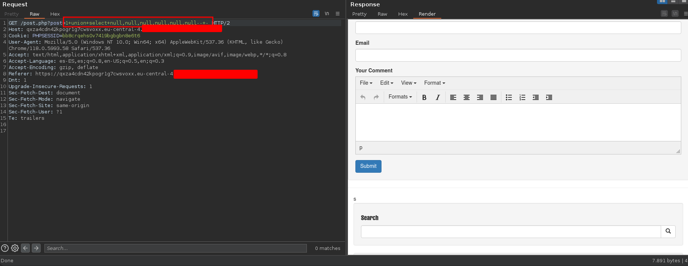
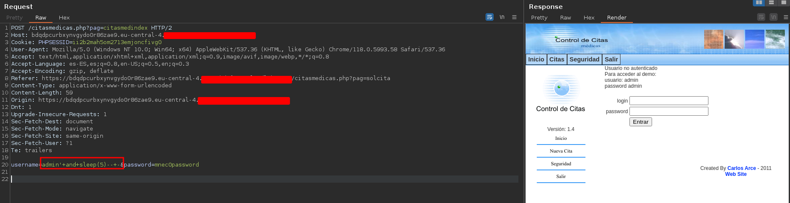

# CHAPTER 5 - SQL Injection Attacks

## SQL Injection Fundamentals

1. SQL injection vulnerabilities occupy position **A3** in the OWASP Top 10 2021.

2. SQL injection is typically classified as a type of input validation vulnerability. (Lie: SQL injection is **not** typically classified as a type of input validation vulnerability.)

3. Proper input validation is a technique commonly implemented to prevent SQL Injection attacks. (Lie: Proper input validation is **not** a commonly implemented technique to prevent SQL Injection attacks.)

4. The primary cause of SQL Injection vulnerabilities is **Application inputs that do not have any input sanitization**.

5. XSSI is **not** a type of Injection vulnerability.

6. In the context of Cybersecurity, SQL Injection vulnerabilities **do** pose a risk to the availability of assets like websites and databases. (Lie: SQL Injection vulnerabilities **do** pose a risk to the availability of assets.)

7. SQL Injection vulnerabilities could potentially lead to remote code execution (RCE). (Lie: SQL Injection vulnerabilities could potentially lead to remote code execution (RCE) **in some cases**.)

8. The Technical impact score of Injection vulnerabilities in the OWASP Top 10 2017 list is **4**.

9. Communication between the web application and the backend database is **not always authenticated**.

10. In addition to supporting Native password authentication, MySQL **does not** support TLS-based authentication.

11. Error-Based SQL Injection primarily relies on the web application to display the response from the backend database. (Lie: Error-Based SQL Injection primarily relies on the web application to **generate error messages**.)

12. Contact Forms are **not** a common target of SQL Injection attacks.

13. The UNION operator in SQL **can be used to combine the results of more than two SELECT statements**.

## Databases

1. An example of a Relational Database is **Oracle Database**.

2. Data encryption is a feature offered by most RDBMSs. (Lie: Data encryption is **not** a feature offered by most RDBMSs.)

3. Relational Databases utilize keys to establish relationships between tables. (Lie: Relational Databases **also use foreign keys** to establish relationships between tables.)

4. Every table in a relational database management system **does not** contain a primary key.

## SQL Primer

1. The SQL statement used to modify an existing record is **UPDATE**.

2. The SQL query that will successfully retrieve the password of the first user in the "accounts" table is **SELECT password FROM accounts WHERE ID = 1;**.

## Finding SQLi Vulnerabilities

1. The Boolean-Based SQLi payload that will always evaluate to FALSE is **AND 0**.

2. Parameter data types are an important factor to consider when constructing a SQL Injection payload. (Lie: Parameter data types are **not** an important factor to consider when constructing a SQL Injection payload.)

3. Injectable parameters can also be sent in the body of an HTTP request.

4. The injected SQL query that will result in an authentication bypass when executed is **SELECT username FROM accounts WHERE username = '' OR 1=1#**.

### **LABORATORY 1**. Mutillidae 2

[CHEAT SHEET](https://github.com/payloadbox/sql-injection-payload-list)

**Mutillidae II Login**

First we login


Trying with a simple "'" in the username field. It returns an error, error based SQLi.


Let's try a boolean.


We logged in as **admin**.



**User Lookup (SQL)** 


If we fail, the page show us an error.


Trying the simple "'".


Knowing the anatomy of the query we can form the SQLi easier. Trying the same SQLi as before we see the page outputs all the data. Because in the query select everything.


It could also be done in Burp Suite. REMEMBER the URL encode!

**View Blogs**


In this case we can't modify the data because is not an injectable field from the page, the data is beeing sent via POST method.
Choose someone and intercept the request with **Burp Suite**.


Now we have the request captured we can do some tests. We can modify the sent data.


Send it to the repeater and try the simple "'".


Let's try the same as before. We are not seeing any additional information. Can be a blind SQLi.


Trying with this it show us the content of the table **accounts**.


## In-Band SQL Injection

1. RDBMSs like MySQL and SQLite have unique database error messages when supplied with syntactically incorrect queries. (Lie: RDBMSs like MySQL and SQLite do **not** have unique database error messages when supplied with syntactically incorrect queries.)

2. The Burp Suite module that can be used to automate the identification of Error-Based SQL Injection vulnerabilities is **Intruder**. (Lie: The Burp Suite module that can be used to automate the identification of Error-Based SQL Injection vulnerabilities is **not Intruder**.)

3. In certain cases, you will need to combine Boolean operations with Union-Based SQLi payloads to execute the query successfully. (Lie: In certain cases, you will **not** need to combine Boolean operations with Union-Based SQLi payloads to execute the query successfully.)

### **LABORATORY 1**. PHPMyRecipes

**Objective**: Your task is to find and exploit this vulnerability.

This is the page interface.


Capturing the request with **Burp Suite**.


Send the request to the repeater.


If we search some information about the frameware we found some **SLQi** exploits.


Searching in the exploit we identify the vulnerable field.


Time to use **sqlmap**. Said "Y", "Y" and "N".


**Sqlmap** have found the query.



Let's find the field in the web and insert that code.


I captured the request with **Burp Suite** because the field has a max lenght. It seems to have worked.


Now modify the query to obtain valuable information.


### **LABORATORY 2**. Vulnerable Results Portal: Union Based SQLi

**Note**: The backend database is SQLite.

**Objective**: Leverage the vulnerability to determine the SQLite version and the dump flag from the database!

The page interface.


If we input something.


I have used this to show the version of the database.

```sql
' union select 1,2,sqlite_version(),4,5-- - 
```
The result is this one.


Searching information about SQLite I found this.[SQLite](https://www.sqlite.org/schematab.html)

> The schema table can always be referenced using the name "sqlite_schema", especially if qualifed by the schema name like "main.sqlite_schema" or "temp.sqlite_schema". But for historical compatibility, some alternative names are also recognized, including: <br> sqlite_master<br> sqlite_temp_schema<br> sqlite_temp_master

```sql
' union select 1,2,tbl_name,4,5 from sqlite_master-- - 
```

We identify 2 tables. Now we know the name of the table we have to find the numebr of columns and the names.


With that query we can see how the table has been created.

```sql
' union select 1,2,sql,4,5 from sqlite_master-- - 
```


For list the content in the table us this.

```sql
' union select 1,2,flag,value,5 from secret_flag-- -
```


## Blind SQL Injection

1. Boolean-Based SQL Injection payloads can be used for both In-Band and Blind-Based SQL Injection attacks.

2. This SQL injection **`or SLEEP(5)#`** will delay the web application's response by 5 seconds.

### **LABORATORY 1**. OpenSupports

**Objective**: Your task is to find and exploit this vulnerability.

We search the name of the frameware in google adding expoit and we found a SQLi vulnerability.


We see the URL, the vulnerable field and de query sent.


We are not haveing the /support/ directory so try with an other exploit.


We see a direcotry and the query sent.


It exist, let's try to insert the query.


And it worked!




### **LABORATORY 2**. Victor CMS

**Objective**: Your task is to find and exploit this vulnerability.

Search about the frameware in google.


We see which is the vulnerable url.


So capture de requests with **Burp Suite** and send it to the repeater.


Now use the following SQLi.


We see with 6 null's doesn't do anything new.



With 7 null works!


Let's see which one is the injectable parameter. Is the 3rd one.

Version


Database


With this query we list all the databases.


Now the tables for a gived database.


Now the columns for a gived table.


And now we can dump the credentials.


### **LABORATORY 3**. CiMe Citas Medicas

**Objective**: Your task is to find and exploit this vulnerability.

The interface page is the next one.


Capture the request with **Burp Suite**.


Try to do a SQLi with a sleep. It must load the page 5 more seconds. It does.



## NoSQL Injection


1. MongoDB is an example of a NoSQL database that stores data in JSON files.

2. NoSQL databases utilize a dynamic database schema.


### **LABORATORY 1**. MongoDB: Basics

Questions:

1. How many databases are present is mongodb cluster?
    
    

2. How many collections are present in database users?
    
    

3. What is the value of flag obtained from the mongodb cluster?

    

4. What is the email address of user named “Heather” from “current” user collection?

    

5. How many users are present in “past” collection in users database?

     

6. How many cities of state “Massachusetts” are present in the collection city in database city?

    

7. How many cities have population greater than 15000 in the collection city in database city?

    

8. How many cities of state “Indiana” have population  greater than 15000 in collection “city” in database “city”?

    
    
9. How many cities of have population less than 100 or belongs to state “Indiana” in collection “city” in database “city”?

    

10. How many Cities have their name starting with “AN” in collection “city” in database “city”?

    

11. What is the name of 101st city in collection “city” when sorted in ascending order according to “city” in database “city”?

    

12. What is the average population in collection “city” in database “city” (Upto two decimal places)?

    

### **LABORATORY 2**. MongoDB: NoSQL injection

**Objective**: Fetch the list of all users  (or other relevant info about them) and retrieve the flag!.

This is the page interface.


If we search something we see the input in the url.


Let's try a typical NoSQL injection.

```bash
https://page.com/?name[$ne]=alice
```
