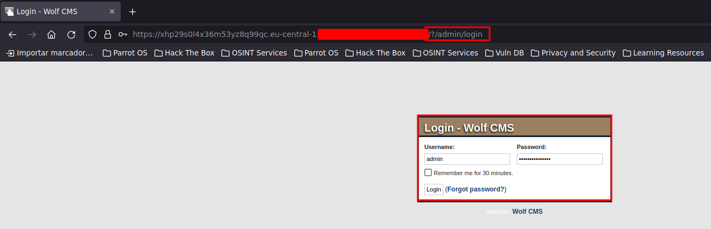
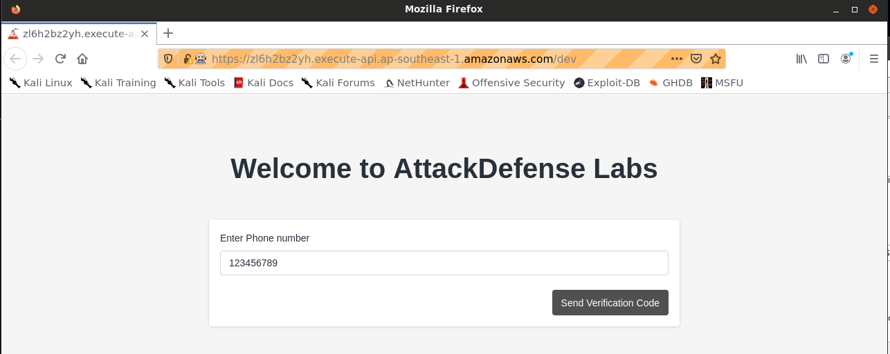
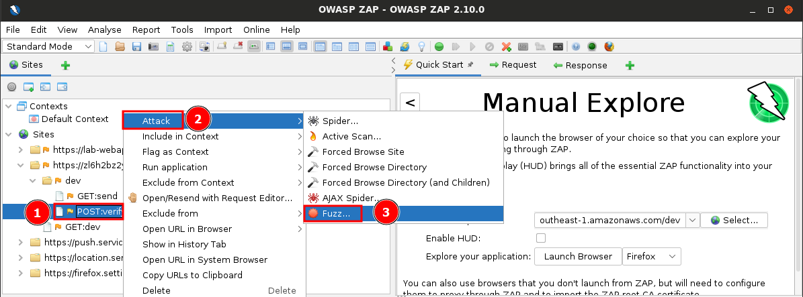
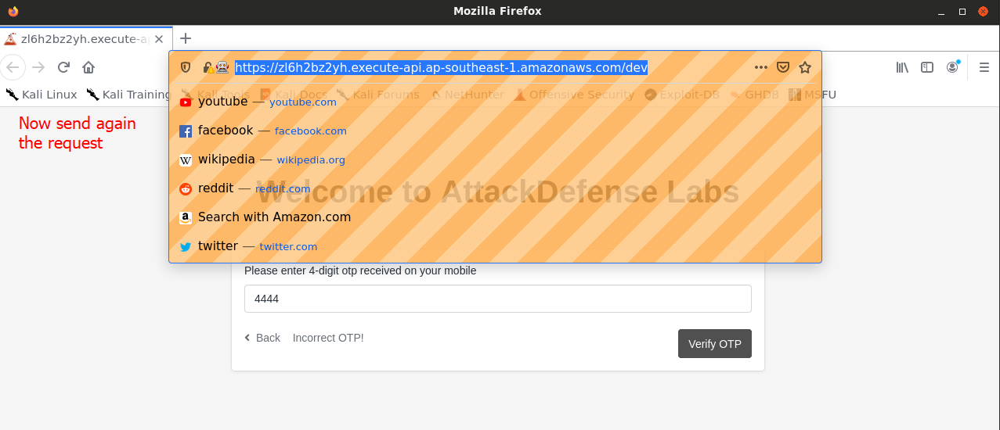
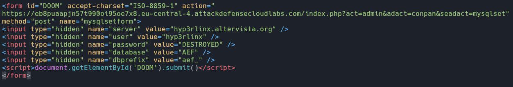

# CHAPTER 6 - Common Attacks

## HTTP

1. Input Validation and Sanitization can help defend against HTTP method tampering attacks.

2. POST is commonly targeted in HTTP method tampering attacks.

3. HTTP method tampering in web application penetration testing involves manipulating the HTTP request method to gain unauthorized access.

4. The Authorization HTTP header is used to send the Basic Authentication credentials to the server.

5. In Basic HTTP Authentication, the username and password are transmitted to the server as plain text, base64-encoded in the HTTP headers.

6. The HTTP status code typically returned when authentication fails in HTTP Digest Authentication is 401.

7. HTTP Digest Authentication differs from Basic Authentication in that it encrypts credentials before transmission.

### **LABORATORY 1**. Attacking HTTP Authentication with Hydra

**Objective**: Perform Dictionary Attack on password-protected directory "/basic" and "/digest"

**dictionary**: /root/Desktop/wordlists/100-common-passwords.txt

Let's see which is our IP.

```bash
ifconfig
```


**/basic**


Let's attack it with **hydra**. We know the user "admin".

```bash
hydra -l admin -P /root/Desktop/wordlists/100-common-passwords.txt 192.86.45.3 http-get /basic/
```


We enter the credentials.


**/digest**


Let's attack it with **hydra**. We know the user "admin".

```bash
hydra -l admin -P /root/Desktop/wordlists/100-common-passwords.txt 192.86.45.3 http-get /digest/
```


We enter the credentials.


## Sensitive Data Exposure

An attacker can exploit sensitive data exposure vulnerabilities in a web application by extracting sensitive data from logs or error messages.

### **LABORATORY 1**. Vulnerable Apache III

**Objective**: Your objective is to login into the webapp as 'admin' user and retrieve the flag!

This is the interface of the web.


Let's fuzz the page.


Try to go to the directory.


And here we have the credentials.


Let's use it.



And we are inside as administrator.


## Broken Authentication

1. The difference between a dictionary-based brute force attack and a traditional brute force attack is that dictionary-based attacks use a predefined list of possible passwords, while traditional brute force attacks try all possible combinations.

2. The purpose of Burp Repeater in a login brute force attack is to send a single request repeatedly with different login credentials.

3. In a web application penetration test, the primary challenge when attempting a brute force attack against OTP-secured login systems is predicting the next OTP value.

4. The primary purpose of OTP (One-Time Password) security in web applications is to enhance security by generating a unique password for each login attempt.

### **LABORATORY 1**. Vulnerable Bank Portal: Dictionary Attack

**Objective**: Leverage the broken authentication vulnerability and access the administrative portal.

**Instructions**: 

- This lab is dedicated to you! No other users are on this network
- Once you start the lab, you will have access to a Kali GUI instance.
- Your Kali instance has an interface with IP address 192.X.Y.2. Run "ip addr" to know the values of X and Y.
- Email ID to perform dictionary attack: admin@secbank.com
- Do not attack the gateway located at IP address 192.X.Y.1

The page interface.


Let's capture the request with **Burp Suite**.


Click on "Forward" button.


Now we are haveing the request.


Send it to the *intruder*. Must to see like this.


Define the payload. And click *Start attack* button.


We can filter by the Length. Is bigger than the others.


If we check the response we can see the information.


Now login with the credentials.


### **LABORATORY 2**. Unlimited Attempts

**Objective**: Brute force the 4 digit one-time password and bypass the authentication. 

**URL**: https://zl6h2bz2yh.execute-api.ap-southeast-1.amazonaws.com/dev

Page interface. If we enter a number it request a four digits number.


Let's capture the request with **Burp Suite**.


After some attempts I think is better idea to use **OWASP ZAP**.So open the frameware.


Paste the url and *Launch Browser*.


And put a phone number and OTP number.




Now let's do a spider attack. This is the POST request.


Now select the FUZZ attack.



Now double-click on the otp number > add > and add again.


Select the typpe and the range. And then press OK.


Now create an alert. And *Start Fuzzer*.


When it ends just sort by State and which isn't FAILED (the tag we made before), will be the correct one.


Here we have the response. So copy the cookie.


Do a break. Open the browser and send again the request.




Now here replace the cookie and click there to submit the break.


And we should logged in.


## Session Security

1. The HTTP header typically used to transmit session cookies between the client and server is `Set-Cookie`.

2. Storing session data on the client-side is NOT a recommended practice for secure session management.

3. Session IDs are typically transmitted between the client and the server in all of the following ways: in plain text within the URL, as part of the HTTP request headers, and as a hidden field in the web page's HTML.

4. The HTTP header used to set cookies on the client-side is `Set-Cookie`.

5. The primary risk associated with a successful session hijacking attack is unauthorized access to the victim's session and data.

6. The primary difference between session fixation and session hijacking attacks is that session fixation involves setting a session ID, while session hijacking involves impersonating a user's session.

7. A common countermeasure to protect against session hijacking via cookie tampering is regularly changing session IDs and cookies.

### **LABORATORY 1**. Improper Session Management III

**Objective**: Leverage the broken authentication vulnerability and access the administrative portal.

The following credentials might be needed:

Username: james@secbank.com
Password: password1

Intercept the request with **Burp Suite**. Note we are looking for cookie session not for credentials. Click *Forward*.


Here we have the request. 


I send it to the repeater and watched the response headers to find the cookie. 


It seems to be encoded in base64 let's try to decode it.


What will occur if we change the **admin=False** for **admin=True** and use that cookie? Let's see.


Now go to the repeater and put the cookie on it.


## CSRF

1. The HTTP method commonly used in CSRF attacks is **POST**.

2. CSRF (Cross-Site Request Forgery) is **an attack where a malicious site tricks a user's browser into performing actions on another site without their consent**.

3. Web applications that lack proper anti-CSRF defenses are most susceptible to CSRF attacks.

### **LABORATORY 1**. Advanced Electron Forum

**Objective**: Your task is to find and exploit this vulnerability.

Username: admin
Password: password1

This is the page interface. We see something interesting, the version of the frameware.


Search about the version on searchsploit. It is vulnerable to CSRF!


Take a look at the exploit.


So take the form and adapt it to our requirements. The document has to be a html.



Now login with the given credentials.


Open the html in the browser and the credentials must to be changed.


And now we can't access the database because the credentials have been changed.


## Injection & Input Validation

1. The character often used by attackers to separate multiple commands in a command injection attack is the **Semicolon**.

2. In command injection attacks, the component often targeted by attackers is the **server's operating system or shell**.

3. User-generated content is typically vulnerable to PHP code injection attacks in web applications.

### **LABORATORY 1**. PHP Code Injection

**Objective**: Perform Command Injection on the web app.

This is the page interaface.


Let's try to inject commands, in the field we cannot type anything it pop up us a windows to select a file. So send it to **Burp Suite**, select any file.


Send it to the repeater and try to inject commands. We are not seeing any response. So try to use nc.

Listener.


And nc request to the listener.


And it works!


Send a reverse shell and we will be in.


Here we have the flag.


### **LABORATORY 2**. PHP Code Injection

**Objective**: Perform code injection on the web application and execute arbitrary commands on the target machine. 

This is the page interface. So enter with the given credentials and choose the PHP Code Injection bug.


We have a parameter so try to inject php commands. And it WORKED!


## Security Misconfigurations

1. The impact of a successful RCE via MySQL attack on a web application is the **Execution of arbitrary code**.

### **LABORATORY 1**. RCE via MySQL

**Objective**: Leverage the misconfiguration and execute arbitrary commands on the target machine. 

If we perform a **nmap** scan we will see the page is hosting a db and root account has empty password.


Just connect to the database as root with out providing password.

```bash
mysql -u root -h ip
```


Showing data.


We know the admin credentials. This isn't a plain text password is hashed in MD5 so i will crack it.


Now we can enter.


Now we will try to execute commands from Mysql session. First we have to do some tests.

It works! It means that MySQL service can write into arbitrary directories provided the directory is world writable.


Let's inject php code.


Now if we go to the web and verify if the file exist. And it does.


Inject commands.

