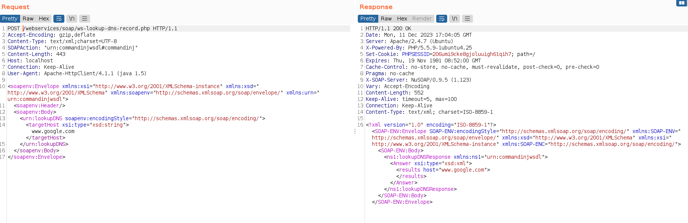

# CHAPTER 8 - Web Services

## Web Services


1. A key characteristic of web services is that they allow interoperability between different software systems.

2. A web service is best described as a set of functions or procedures accessible over the internet for data exchange.

3. In terms of designing a user-friendly interface for interacting with applications, web services are typically more focused than APIs.

4. In terms of implementation, both web services and APIs can be lightweight or heavyweight depending on their design.

5. A key similarity between XML-RPC and SOAP is that both are tightly coupled with the HTTP protocol for communication.

6. A characteristic of SOAP that distinguishes it from XML-RPC is that SOAP has built-in support for complex data types, while XML-RPC is limited to simple data types.

7. The section of a WSDL document that describes the data types used in a SOAP web service is `<types>`.

8. The primary purpose of WSDL (Web Services Description Language) in the context of SOAP web services is to describe the structure of the web service requests and responses.

9. The primary role of the `<types>` element in a WSDL document is to specify the data types used in a SOAP web service.

## Testing

1. In SOAP web service testing, the component commonly responsible for enforcing security policies is the **SOAP web service**.

2. In the context of SOAP web service security, "WS-Security" stands for **Web Services Security**.

3. The element of a WSDL document that typically contains the methods provided by a web service is **\<portType\>**.

4. The primary purpose of the **\<portType\>** element in a WSDL document is to define the ports supported by the web service.

5. WSDL disclosure can be mitigated to enhance web service security by **implementing strict access control and authentication mechanisms**.

6. A SOAP web service might hide certain methods in its WSDL document to **enhance security by restricting access to sensitive functionality**.

7. The primary goal of a SQL injection attack on a SOAP web service is to **manipulate the web service's database and retrieve or modify data**.

8. The component of a SOAP request typically vulnerable to SQL injection attacks is the **SOAP Body**.

9. Command injection vulnerabilities in SOAP web services can be discovered during security testing by **attempting to inject arbitrary system commands into SOAP requests**.

10. A common example of a command injection attack payload in a SOAP request is **\<command\>ls -la\</command\>**.

### **LABORATORY 1**. Web Services

**Objective**: Perform the following attacks on the provided SOAP-based web service and collect all three flags (flag1, flag2, and flag3):
- WSDL Enumeration - Invoking hidden methods - Bypass SOAP body restrictions - SQL Injection - Command Injection

**Flag Information**: 
- flag1 and flag2 would be retrieved by invoking the hidden methods.
- flag3 would be invoked from the server file system after exploiting the command injection vulnerability.

This is the target.


Launch a **nmap**.


Open the web page and select **Web Services** > **SOAP** > **Username Enumeration** > **Lookup User**:


Now is time to enumerate the WSDL file.


If we are filtering by "operation" we will find five web services.


Fall back and click on getUser.


Open the **Burp Suite** and as the web is saying copy and paste there.


Let's paste it on the **repeater**. Delete "/mutillidae" and will be ready to send.


Now we can see the **username** and the **signature**.


Try with **deletUser**.


This time we received a 200 code, but also an error.


Check the WSDL file and search for **deleteUser**. We need this two parameters.


Added into the Burp request.


This displays the query.


Just add a simple SQLi. End we will display the **flag1**.

```sql
' or '1'='1
```


Now with te purpose of display **flag2** use the **getAdminInfo**.


Add this line in the request. And delete the **Headers**.


Send the request and the result should be a 200, providing admin credentials and the **flag2**.


Now select **Web Services** > **SOAP** > **Command Injection** > **DNS Lookup**:


Click on WSDL.


Now fall back, click on **lookupDNS** and copy the request on **Burp Suite**.


Let's paste it on the **repeater**. Delete "/mutillidae" and will be ready to send.



Now we are sending the semicolon and still getting a **200 OK**.


Try to insert commands.


Time to find the **flag3**.


Display it.

