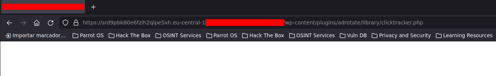
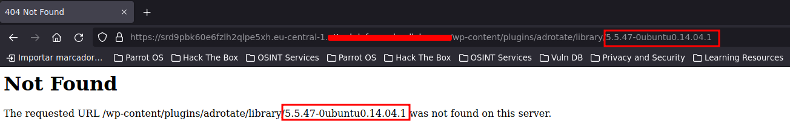
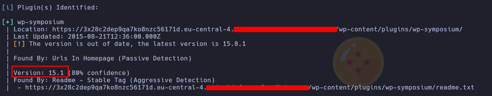
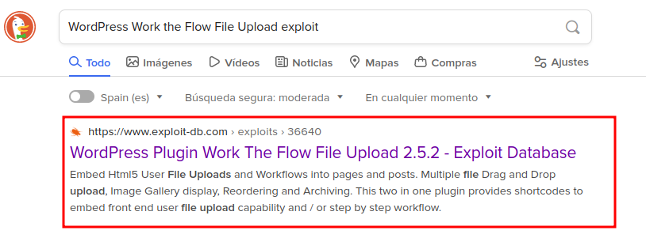
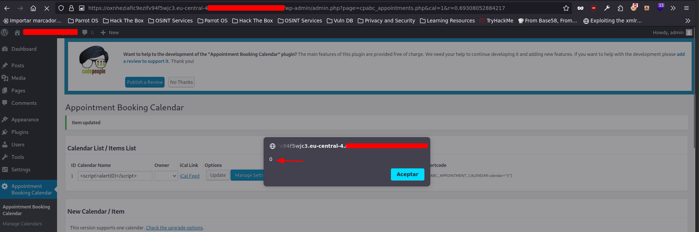

# CHAPTER 9 - CMS Pentesting

## Security Testing Introduction

1. A common vulnerability in Content Management Systems is **CSRF**.

2. Before conducting CMS penetration testing on a website you don't own, you should **seek explicit authorization from the website owner**.

3. In WordPress penetration testing, the term "enumeration" refers to **discovering users, plugins, and themes**.

4. The security testing technique often used to identify vulnerabilities in custom WordPress themes and plugins is **code review**.

5. A common WordPress security best practice that penetration testers may recommend to mitigate vulnerabilities is to **regularly update themes and plugins**.

Certainly! Here are the informative sentences based on the provided questionnaires:

## Information Gathering & Enumeration

1. During a penetration test, the WordPress version can be enumerated by analyzing the website's JavaScript files for version references.

2. The commonly used URL path to access the WordPress README.html file for version enumeration is `/readme.html`.

3. The primary purpose of `xmlrpc.php` in WordPress is to provide an interface for remote communication.

4. Penetration testers can enumerate installed WordPress themes by inspecting the HTML source code for references.

5. The HTTP request method commonly used during file and directory brute forcing is `GET`.

6. When a directory or file is not found on a web server, the typical HTTP response code is `404`.

7. The primary goal of file and directory brute forcing in WordPress security assessments is to uncover sensitive files and directories.

8. The output of the Nmap NSE script `http-wordpress-enum-users` provides a list of users who have commented on the site.

9. The output of the Nmap NSE script `http-wordpress-enum` includes information about the WordPress version and installed plugins.

#### **LABORATORY 1**. WordPress AdRotate

**Objective**: Your task is to find and exploit this vulnerability.

This is the web page interface.


Launch a **wpscan**. It shows a vulnerable plugin. Search about it


Let's read about it.


It exists, can try to do the **SQLi**.



If we use we are displaying the version on the error and in the URL.




#### **LABORATORY 2**. WordPress RCE (CVE-2017-5487)

**Objective**: Your task is to find and exploit this vulnerability.

This is the web page interface.


Let's launch a **wpscan**.


Let's search information about this version and its exploits.


Download it and try. Put the target in the url.


And run it. It works, it displays the id, name, and username.


#### **LABORATORY 3**. WP Security Audit Log plugin Sensitive Information Disclosure (CVE-2018-8719)

**Objective**: Your task is to find and exploit this vulnerability.

This is the web page interface.


Let's launch a **wpscan**.


"/upload" directory has directory listing enabled.


Search about this.


Take a look.

> No protection on the wp-content/uploads/wp-security-audit-log/* which is indexed by google and allows for attackers to possibly find user information.

In the following path we can list a log, getting some information.


After doing some tries in the login page appears a new log file.


Here we have it.


## Vulnerability Scanning

1. In the "vulnerable plugins" section of WPScan's scan output, the information reveals plugins with known vulnerabilities.

2. Files commonly found in the "/wp-content/uploads/" subdirectory of WordPress include Media Files.

#### **LABORATORY 1**. WP Symposium plugin SQL Injection (CVE-2015-6522)

**Objective**: Your mission is to find and exploit this vulnerability.

This is the web page interface.


Launch a **wpscan**. Is showing a plugin. Search about.



The plugin has vulnerabilities.


Take a look.


Try it.


## Authentication Attacks

1. In WordPress security testing, a brute force attack against the WP-JSON authentication endpoint commonly targets the parameter `wp_user` to guess usernames.

2. The HTTP method typically used in a brute force attack against the XML-RPC interface of WordPress is `POST`.

#### **LABORATORY 1**. WordPress Plugin

**Objective**: Your task is to find and exploit this vulnerability.

Username: pentester
Password: password1

They are giving us credentials maybe we can use it to find any vulnerability.

This is the web page interface.


Launch a **wpscan**. Uploads has listing enabled. Nothing interesting, maybe we need to be logged in.


Logging in.


It have a plugin installed. Search information about.




Take a look.


I will recover the shell i have been using since before. Try to upload and execute commands.


Upload the shell.


Now go to the directory and try to inject commands.


We are having command execution.


## Exploiting Vulnerabilities

1. In a WordPress site, file upload filters are typically configured in the `.htaccess` file.

2. To mitigate the risk of arbitrary file upload vulnerabilities in WordPress, web developers and administrators can implement file upload filters.

3. The type of XSS attack that occurs when the malicious script is stored on the target server and served to users who access a specific page or resource is called Stored XSS.

#### **LABORATORY 1**. WP Appointment Booking Calendar Stored XSS (CVE-2020-9371)

**Objective**: Your task is to find and exploit this vulnerability.

```
Username: admin
Password: password1
```

They are giving us credentials maybe we can use it to find any vulnerability.

This is the web page interface.


Launch a **wpscan**. Uploads has listing enabled. Nothing interesting, maybe we need to be logged in.


Logging in.


This are the plugins installed. The uniq active is the "**Appointment Booking Calendar**"


Searching information about. The version match.


Take a look.


Follow the instructions.


And clicking in "Manage Settings" the XSS works.



## WordPress Black-Box Pentest

1. To "double extension" a malicious file during an upload filter bypass attempt means to use two different file extensions in the filename.

2. The file upload filter bypass technique that aims to trick the system into thinking a file is of a different, allowed type is MIME Type spoofing.

### **LABORATORY 1**. Exploiting WordPress

**Objective**: Gain admin access on the WordPress website. Also obtain a shell on the target machine and get the flag file from the target machine.

This is the web page interface.


Launch a **wpscan** and it enumerate a plugin.


Search information about.


We have found a directory with listing enabled and a lot of screenshots inside, we discover a username.


Let's try to log in bruteforcing with **Burp Suite**.


Send it to the **intruder**. Add the payload and start the attack.


Founded.


Now with the credentials and inside the wordpress panel exploit the plugin vulnerability.

Time to follow the exploit instructions and upload the fake image.


Uploading the "image".


Intercept this upload with **Burp Suite**.


Image uploades successfully.


Now start listening with nc and reload the page.


And we get a reverse shell.


Can use commands.


Lets find the flag.


**FLAG**
```bash
2178184f410766ecdda302962a9849a2
```