# CHAPTER 1 - Introduction to Web Application Security Testing

## Introduction to Web App Security Testing

1. Web Browser is responsible for interpreting and rendering HTML/CSS to display web pages.

2. JavaScript is primarily used to enable interactivity and dynamic content on web pages.

3. The primary objective of web application security testing is to identify and mitigate security vulnerabilities in the application.

4. Penetration Testing involves testing an application with the intent of not just finding vulnerabilities but also exploiting them to assess potential impact.

5. DoS (Denial of Service) aims to overload the application or server by flooding it with an excessive number of requests.

6. True. A Threat in Cybersecurity is an intentional or accidental event that can lead to exploitation or compromise of a system.

7. SQLi (SQL Injection) targets the application's database by exploiting improper handling of user-supplied input.

### Common Web Application Threats & Risks

| Threat/Risk | Description |
| ----------- | ----------- |
| XSS (Cross-Site Scripting) | Attackers inject malicious script into web pages viewed by other users, leading to unauthorized access to user data, session hijacking, and browser manipulation. |
| SQLi (SQL Injection) | Attackers manipulate user input to inject malicious SQL code into the application's database, leading to unauthorized data access, data manipulation, or database compromise. |
| CSRF (Cross-Site Request Forgery) | Attackers trick authorized users into unknowingly performing actions on a web application, such as changing account details, by exploiting their active sessions. |
| Security Misconfiguration | Improperly configured servers, databases, or application frameworks can expose sensitive data or provide entry points for attackers. |
| Sensitive Data Exposure | Failure to adequately protect sensitive data, such as passwords or personal information, can lead to data breaches and identity theft. |
| Brute-Force and Credential Stuffing Attacks | Attackers use automated tools to guess usernames and passwords, attempting to gain unauthorized access to user accounts. |
| File Upload Vulnerabilities | Insecure file upload mechanisms can enable attackers to upload malicious files, leading to remote code execution or unauthorized access to the server. |
| DoS (Denial-of-Service) and DDoS (Distributed Denial-of-Service) | DoS and DDoS attacks aim to overwhelm web application servers, causing service disruptions and denying legitimate users access. |
| SSRF (Server-Side Request Forgery) | Attackers use SSRF to make requests from the server to internal resources or external networks, potentially leading to data theft or unauthorized access. |
| Inadequate Access Control | Weak access controls may allow unauthorized users to access restricted functionalities or sensitive data. |
| Using Components with Known Vulnerabilities | Integrating third-party components with known security flaws can introduce weaknesses into the web application. |
| Broken Access Control | Inadequate access controls can allow unauthorized users to access restricted functionalities or sensitive data. |

## Web Application Architecture & Components

1. The back-end in a web application architecture is responsible for storing and managing the application's data and business logic.

2. CSS (Cascading Style Sheets) in web development is used to control the presentation and styling of web pages.

## HTTP/S Protocol Fundamentals

1. HTTP/1.1 introduced support for persistent connections, reducing the overhead of establishing a new connection for each request.

2. In the HTTP "POST" method, the data gets included in the request's body.

3. Web browsers use the HTTP "GET" method to request a resource from a web server.

4. In an HTTP request, the part that specifies the resource being requested from the server is the Request URL.

5. The default port used by HTTP for communication is 80.

6. The "Cache-Control" HTTP response header informs the browser how long it should cache the response.

7. In HTTP response parsing, the "Content-Type" header specifies the type of data in the response body.

8. The "Set-Cookie" header in an HTTP response contains the data that the browser needs to send back to the server with future requests.

9. The "Referer" header in an HTTP request typically contains the URL of the previous web page from which the request originated.

10. HTTPS ensures secure data transmission by using SSL/TLS encryption to protect data during transmission.

11. The port typically used for HTTPS communication is 443.

### **LABORATORY 1**. HTTP Method Enumeration

**Objective:** Use Burp Suite and Curl to enumerate the HTTP method allowed by the web page/directory. 

First of all we identify which is the target ip.

``` bash
ifconfig
```

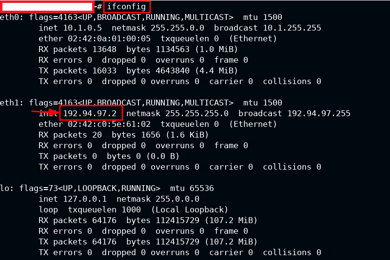

The target ip is 192.x.x.3. Let's see it in browser.

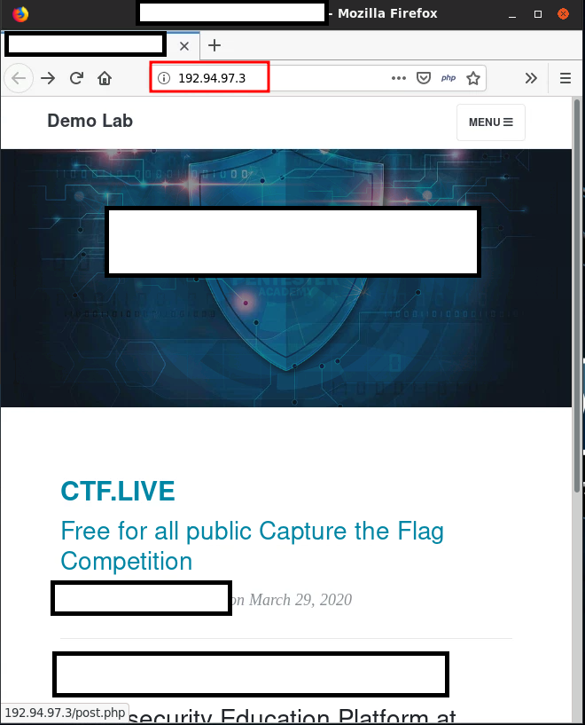

**CURL**

Sending an **OPTIONS** method with *curl*, it should show us the methods allowed in this pages.

``` bash
curl -X OPTIONS 192.94.97.3 -v
```

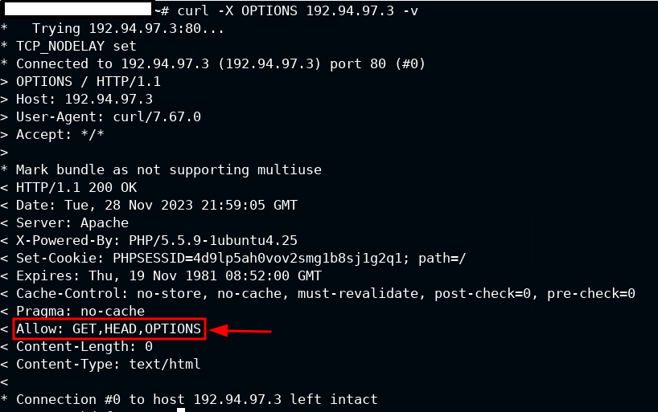

Searching in the web page, i see a login page.

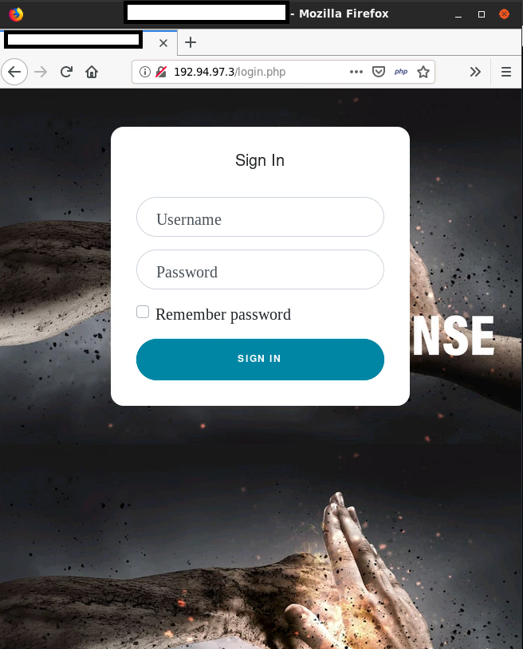

Let's try the same command in this directory.

``` bash
curl -X OPTIONS http://192.94.97.3/login.php -v
```
Now see the **POST** method is allowed.

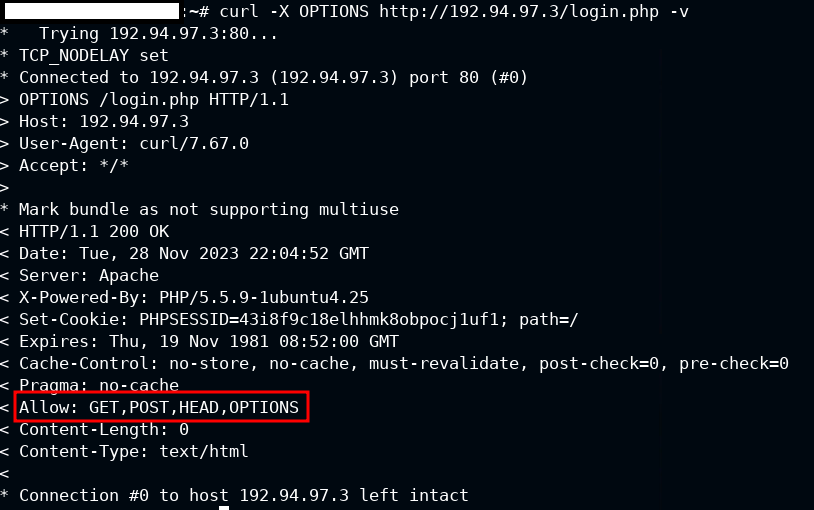

Fuzzing the page i see that it has an uploads directory, i will try and see if **PUT** method is allowed.

```bash
nmap --script http-enum -p80 192.94.97.3 -n -Pn
```

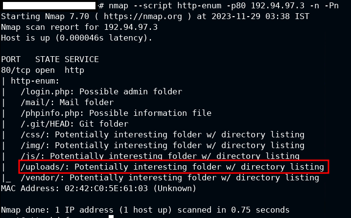

Now i see **PUT** method is denied but allows many more than other pages/directories.

```bash
curl -X OPTIONS http://192.94.97.3/uploads/ -v
```

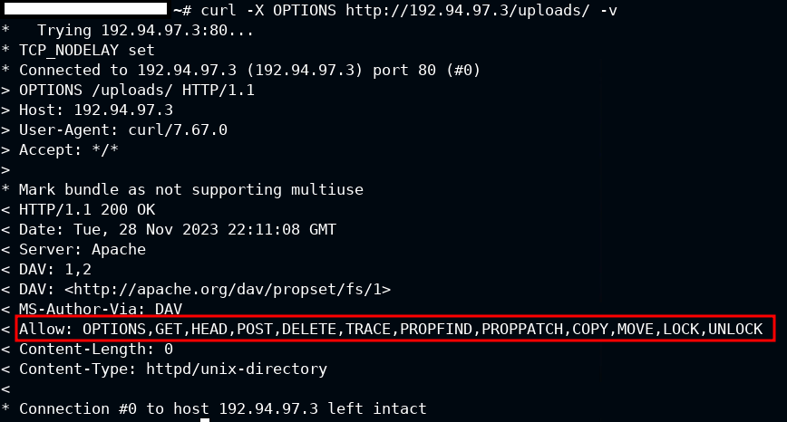

**BURP SUITE**

I have to capture the request with **Burp Suite**. Before that, start the framework and active *FoxyProxy* in the browser. 

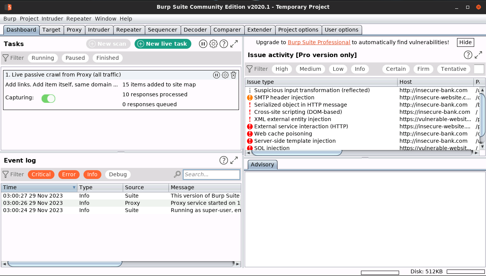
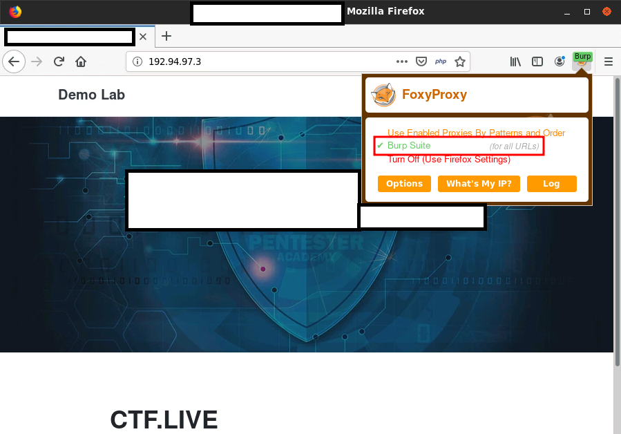

Now capture the request.

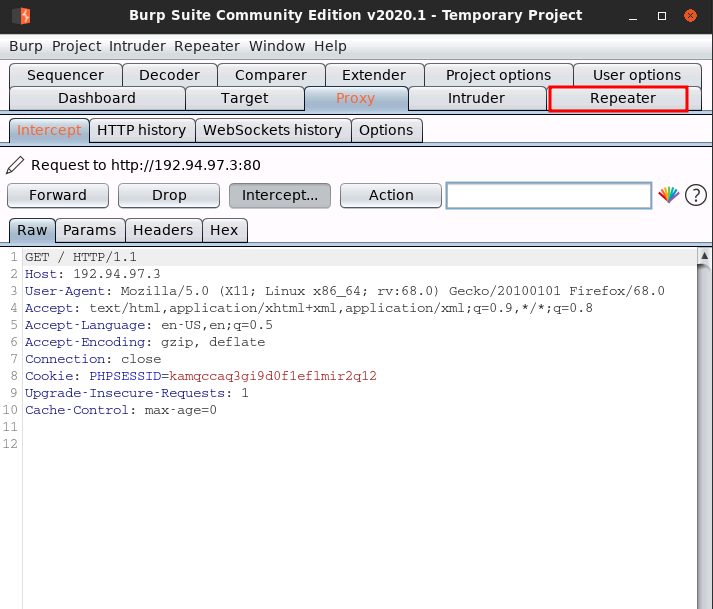

Once i have it, i will send the request to the repeater using **Ctrl + r**. (Do the same with */login.php* and */uploads/*)

Use the **OPTIONS** method and see the results.

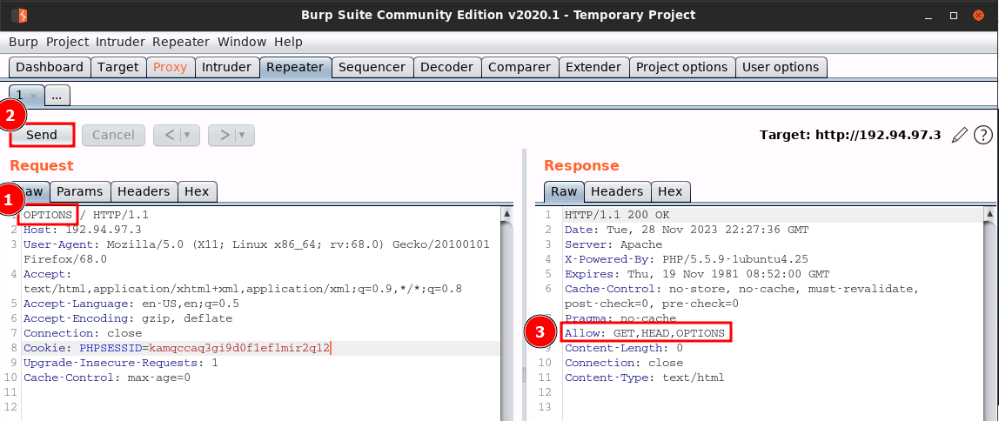

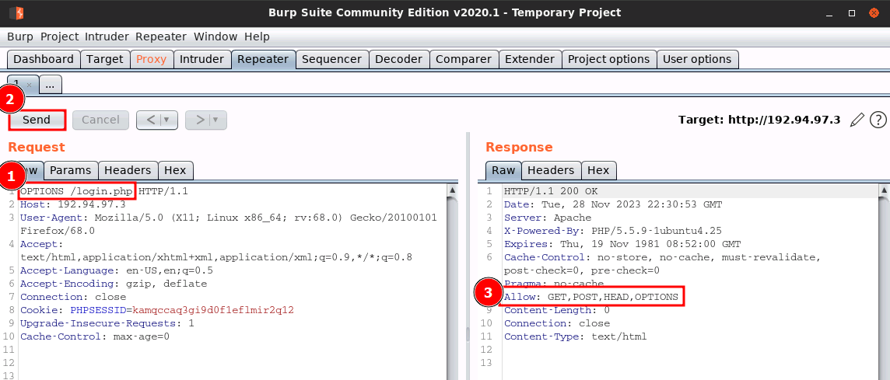

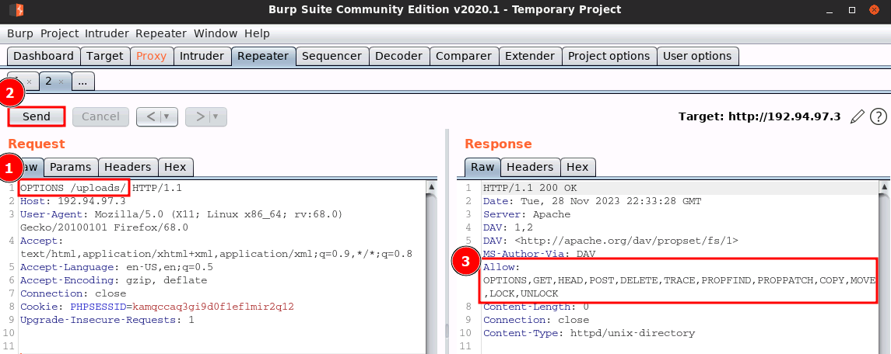

## Testing Lifecycle

1. Following a penetration testing methodology benefits an organization by ensuring that the testing process is consistent and repeatable across different applications.

2. Using a structured web application penetration testing methodology is important as it provides a systematic approach to identifying and addressing security vulnerabilities.

3. The primary concern related to the OWASP Top 10 vulnerability "Security Misconfiguration" is unauthorized access to sensitive files and directories.

4. The OWASP Top 10 vulnerability that refers to the act of injecting malicious code into a web application, which is then executed by unsuspecting users, is XSS (Cross-Site Scripting).

5. The section of the OWASP Web Security Testing Guide (WSTG) that focuses on identifying security misconfigurations in web applications and servers is Configuration Management Testing.

6. A typical activity NOT performed during the pre-engagement phase of a web application penetration test is requesting the source code of the web application for a thorough analysis.

7. The section of the penetration test report that focuses on providing a technical breakdown of each identified vulnerability is Vulnerability Details.

8. It is essential to include the potential impact and risks associated with the identified vulnerabilities in the report to help the organization prioritize remediation efforts based on the risks posed.

**ENGLISH**

|  | Phase | Objectives |
| - | ---- | ---------- |
| 1 | Pre-Engagement | ● Define the scope and objective of the penetration test, including the target web application, URLs, and functionalities to be tested.<br>● Obtain proper authorization and permission from the application owner to conduct the test.<br>● Gather relevant information about the application, such as technologies used, user roles, and business-critical functionalities  |
| 2 | Information Gathering & Reconnaissance | ● Perform passive reconnaissance to gather publicly available information about the application and its infrastructure.<br>● Enumerate subdomains, directories, and files to discover hidden or sensitive content.<br>● Use tools like "Nmap" to identify open ports and services running on the web server.<br>● Utilize "Google Dorks" to find indexed information, files, and directories on the target website. |
| 3 | Threat Modeling | ● Analyze the application's architecture and data flow to identify potential threats and attack vectors.<br>● Build an attack surface model to understand how attackers can interact with the application.<br>● Identify potential high-risk areas and prioritize testing efforts accordingly. |
| 4 | Vulnerability Scanning | ● Use automated web vulnerability scanners like "Burp Suite" or "OWASP ZAP" to identify common security flaws.<br>● Verify and validate the scan results manually to eliminate false positives and false negatives. |
| 5 | Manual Testing & Exploiting | ● Perform manual testing to validate and exploit identified vulnerabilities in the application.<br>● Test for input validation issues, authentication bypass, authorization flaws, and business logic vulnerabilities.<br>● Attempt to exploit security flaws to demonstrate their impact and potential risk to the application. |
| 6 | Authentication & Authorization Testing | ● Test the application's authentication mechanisms to identify weaknesses in password policies, session management, and account lockout procedures.<br>● Evaluate the application's access controls to ensure that unauthorized users cannot access sensitive functionalities or data. |
| 7 | Session Management Testing | ● Evaluate the application's session management mechanisms to prevent session fixation, session hijacking, and session-related attacks.<br>● Check for session timeout settings and proper session token handling. |
| 8 | Information Disclosure | ● Review how the application handles sensitive information such as passwords, user data, and confidential files.<br>● Test for information disclosure through error messages, server responses, or improper access controls. |
| 9 | Business Logic Testing | ● Analyze the application's business logic to identify flaws that could lead to unauthorized access or data manipulation.<br>● Test for order-related vulnerabilities, privilege escalation, and other business logic flaws. |
| 10 | Client-Side Testing | ● Evaluate the client-side code (HTML, JavaScript) for potential security vulnerabilities, such as DOM\-based XSS.<br>● Test for insecure client-side storage and sensitive data exposure. |
| 11 | Reporting & Remediation | ● Document and prioritize the identified security vulnerabilities and risks.<br>● Provide a detailed report to developers and stakeholders, including recommendations for remediation.<br>● Assist developers in fixing the identified security issues and retesting the application to ensure that the fixes were successful. |
| 12 | Post-Engagement | ● Conduct a post-engagement meeting to discuss the test results with stakeholders.<br>● Provide security awareness training to the development team to promote secure coding practices. |